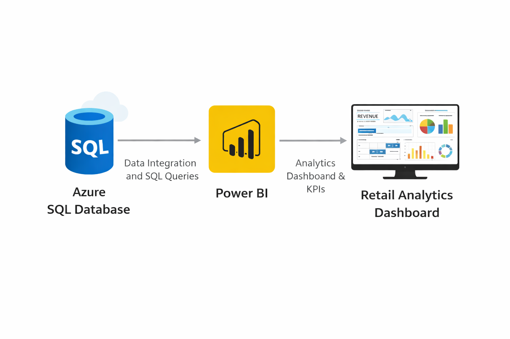
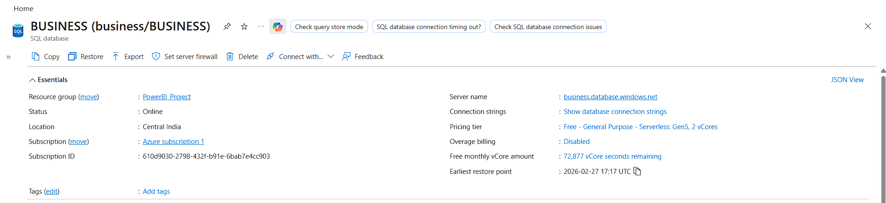
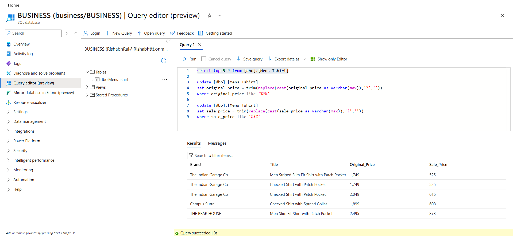
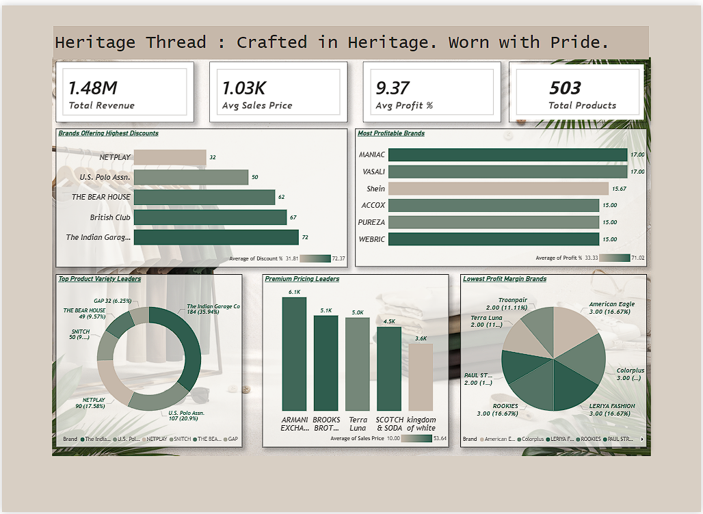

# Retail Analytics using Azure SQL & Power BI



---

## Dashboard Link  

**Live Report:**  
https://app.powerbi.com/view?r=eyJrIjoiM2IyYzhlMGYtYjNiOC00MmMyLTgzMmYtZDAyMDNhNTVkMzMzIiwidCI6ImNlOTAwODg5LTY5NTctNDJlMy04NWNlLTQwNTQyMzZiNjNiZCJ9  

---

## Project Overview  

This project analyzes retail product performance by evaluating brand pricing strategy, discount structure, product distribution, and profitability metrics.

The objective is to design and implement a secure end-to-end cloud data pipeline using Microsoft Azure SQL Database and Power BI to enable real-time, data-driven retail insights.

The solution demonstrates:

- Cloud database configuration
- SQL-based data cleaning and transformation
- Secure Azure integration
- Analytical dashboard creation
- Deployment to Power BI Service

---

## Architecture Overview  

Local Retail Dataset  
→ Azure SQL Database (Cloud Storage)  
→ SQL Data Cleaning & Transformation  
→ Power BI Data Modeling  
→ Interactive Dashboard  
→ Power BI Service Deployment  

---

## Tech Stack  

| Layer | Technology |
|-------|------------|
| Cloud Platform | Microsoft Azure |
| Database | Azure SQL Database |
| Query Environment | Azure Query Editor |
| Data Transformation | SQL |
| Visualization | Power BI Desktop |
| Deployment | Power BI Service |
| Analytical Modeling | DAX |

---

# Azure Cloud Setup

### 1. Azure SQL Database Creation



- Created Azure SQL logical server  
- Configured database under resource group  
- Enabled firewall rules  
- Verified server connectivity  
- Enabled secure authentication  

---

### 2. Query Execution & Data Validation



This confirms:

- Successful table creation
- Data insertion into Azure SQL
- SQL query execution inside Azure Portal
- Cloud-based result validation

---

# SQL Implementation

## 1. Data Cleaning – Currency Symbol Removal

Some pricing fields contained unwanted currency symbols and formatting issues.  
The following SQL queries standardized numeric values:

```sql
update [dbo].[Mens Tshirt]
set original_price = trim(replace(cast(original_price as varchar(max)),'?',''))
where original_price like '%?%';

update [dbo].[Mens Tshirt]
set sale_price = trim(replace(cast(sale_price as varchar(max)),'?',''))
where sale_price like '%?%';
```

---

## 2. Data Validation Query

```sql
select top 5 * from [dbo].[Mens Tshirt];
```

This ensured:

- Cleaned pricing values
- Proper formatting
- Accurate dataset validation

---

# Data Engineering Pipeline  

1. Created Azure SQL Database in Microsoft Azure  
2. Configured logical server and firewall rules  
3. Established secure authentication  
4. Created product table in Azure SQL  
5. Inserted retail dataset into cloud database  
6. Executed SQL data cleaning transformations  
7. Validated records using SELECT queries  
8. Connected Azure SQL to Power BI Desktop  
9. Built multi-visual interactive dashboard  
10. Published report to Power BI Service  

---

# Power BI Dashboard  



The dashboard includes:

## KPI Cards
- Total Revenue
- Average Sales Price
- Average Profit Percentage
- Total Products

## Brand-Level Analysis
- Most Profitable Brands
- Brands Offering Highest Discounts
- Premium Pricing Leaders
- Lowest Profit Margin Brands

## Distribution Analysis
- Product count by brand
- Pricing distribution patterns
- Profit spread comparison

---

# Key Insights  

## 1. Revenue & Pricing Trends  

- Identified brands generating highest total revenue  
- Compared marked price vs sale price variance  
- Evaluated impact of discount percentage on pricing  

---

## 2. Profitability Analysis  

- Highlighted top-performing brands based on profit %  
- Identified brands with lowest margin risk  
- Evaluated average profitability distribution  

---

## 3. Product Distribution  

- Measured product availability per brand  
- Identified premium brand positioning  
- Analyzed pricing clusters across categories  

---

# Security & Cloud Implementation Highlights  

- Azure SQL logical server configuration  
- Firewall rule management  
- Secure cloud authentication  
- Cloud-based SQL execution  
- End-to-end Azure to Power BI integration  

---

# Project Outcome  

This project demonstrates:

- End-to-end cloud-based retail analytics pipeline  
- Azure SQL database provisioning and management  
- SQL-driven data cleaning and transformation  
- Secure cloud integration architecture  
- DAX-based analytical modeling  
- Multi-visual interactive dashboard  
- Deployment to Power BI Service  
